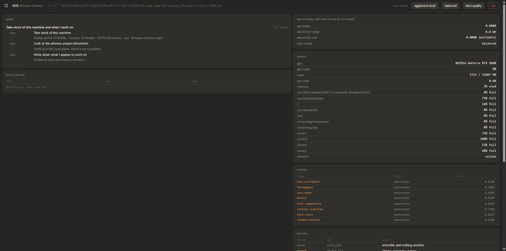
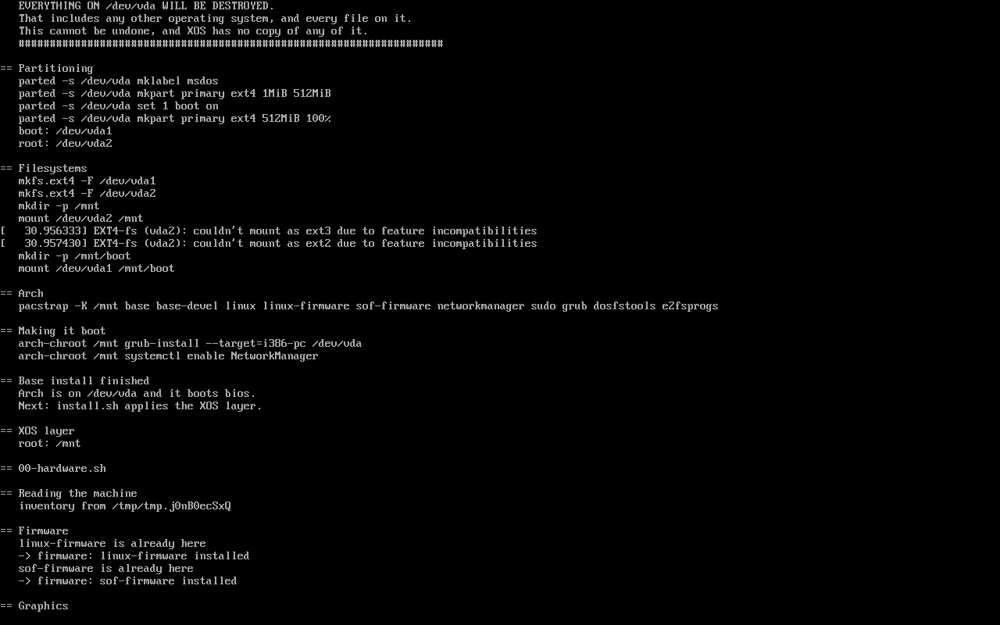
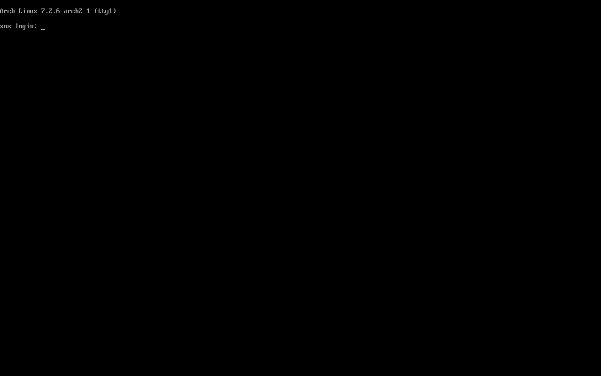

<p align="center">
  
</p>

An AI-native Linux OS. A Rust daemon (`xosd`) is the intelligence layer;
everything else plugs into it. Layered over Omarchy (Arch + Hyprland), never
forked. Nothing imports a model provider, MCP server or channel gateway
directly — everything goes through `xosd`, and every UI is a thin client over
its API.

XOS aims to be a trustworthy local AI that lives on the desktop, understands
system state, remembers context, manages long-running goals, and takes action
without constant prompting. It is built to three rules: it works offline, every
escalation to the cloud is logged with its trigger, and one keystroke halts
every autonomous action.

## Status

**Version 0.3.0.** Every part of the system described below is built and tested:
the daemon, the task graph, memory, the policy engine, the action journal, the
router, Mission Control, the chat TUI, hardware detection, the installer and the
bootable medium.

An install has been carried through onto a disk and the machine boots from it
afterwards — see the screenshots below. That was done in QEMU with KVM.

**No physical machine has run any of this yet.** That is the one thing between
0.x and 1.0. `BUILD.md` records every defect found on the way, including the
eight that only turned up when the installer was actually run.

## Versions

One number, held in `Cargo.toml`, reported by everything that could otherwise
disagree:

```
xos --version        xos 0.3.0
xosd --version       xosd 0.3.0
xos status           first line
```

Mission Control shows it beside the title. The install medium prints it in the
banner and carries it in the image filename, so a stick found in a drawer can be
matched to the XOS on it.

**0.x means no physical machine has run it.** That is the only thing 1.0 waits
for.

## What it looks like

**Mission Control** — the transparency UI. What it is working on, what it has
done, what the machine is doing, which triggers sent work to an API and what
that cost. Served on loopback; forward it over SSH rather than exposing it.



**Installing.** Put the medium in, turn the machine on, and the installer starts
by itself. This is the unattended entry running: partitioning, filesystems,
Arch, the bootloader, and then the XOS layer applied to the new disk rather than
to the medium.



**And the machine it produced**, booted on its own with no medium in it:



Every screenshot here was taken from a real run in QEMU with KVM. None of them
are mockups.

## Hardware compatibility

| Hardware | Local model | Status |
|---|---|---|
| Ryzen + GTX 1080 8GB | Gemma 4 E4B | confirmed working |

Report a machine by opening a pull request that adds a row.

### Graphics

XOS resolves a driver for the card in the machine rather than assuming one, and
every recommendation carries a fallback chain that ends somewhere which always
produces a picture.

| Vendor | Covered |
|---|---|
| NVIDIA | Every card of the last five years — RTX 30, 40 and 50 series, laptop parts and the professional cards — plus Turing, Volta, Pascal, Maxwell, Kepler and Fermi on their last supported branches. A card newer than this build gets the current branch rather than nouveau, and says the answer was inferred. |
| AMD | GCN through RDNA, with the kernel parameters that older generations need to avoid falling silently back to `radeon`. |
| Intel | Integrated graphics, i915 and Xe. |
| Everything else | virtio, Bochs, VMware, VirtualBox, Hyper-V, Matrox, ASPEED, VIA, SiS, Cirrus and S3 — and any display device at all through a generic path, so a machine XOS has never seen still comes up with a screen. |

Ask before you buy, or about a machine you do not have:

```
xos hardware --device 10de:2684     # what XOS would do with an RTX 4090
```

## Workspace

| Crate | Binary | Responsibility |
|---|---|---|
| `xosd` | `xosd` | XOS Core — the daemon and every subsystem |
| `xos-cli` | `xos` | Command line client and chat TUI |
| `xos-bench` | `xos-bench` | XOS Bench — model validation |

## Build

```
cargo build
cargo run --bin xos
```

## Documentation

| File | Contents |
|---|---|
| `CLAUDE.md` | Architecture context and non-negotiables |
| `STYLE.md` | Visual language and copy voice |
| `BUILD.md` | Build ledger, task status and gates |
| `PROMPTS.md` | The build prompts, P0 through P14 |
| `docs/spec.md` | The full specification |
| `brand/README.md` | The mark, and the one rule about colouring it |

## Licence

MIT. See `LICENSE`.

## Installing

Write the XOS medium to a USB stick and turn the machine on. **The installer
starts by itself** — there is no command to type. It works out the hardware,
shows you the disks, asks which one, and does the rest.

The boot menu also carries an unattended entry, *Install XOS automatically*,
which picks the largest disk and erases it without asking anything else. It
counts down for twenty seconds first and `Ctrl+C` stops it, and it is never what
pressing Enter lands on.

Building the medium needs an Arch machine, because `mkarchiso` does:

```
sudo ./iso/build.sh --check     # say what is missing, build nothing
sudo ./iso/build.sh             # build it into out/
```

The medium boots on legacy BIOS and on UEFI, the install completes, and the disk
it produces boots. All of that was done in QEMU. **No physical machine has run
it yet**, so use a virtual machine first.

## The manual

[docs/manual.md](docs/manual.md) — installing, running, supervising and stopping XOS.

[docs/headless.md](docs/headless.md) — running it with no desktop: a box on your
network with a local model, reached over SSH.

Every command in both is checked against the binary by `docs/manual.test.sh`.
